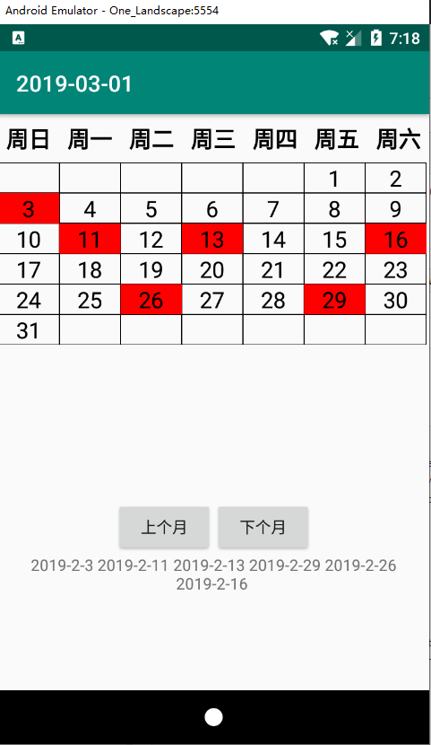

项目需要进行日历的多选，遂使用**`GridView + BaseAdapter`**实现了一个多选日历

项目下载：[MultiSelectCalendar.zip](images/1746757547.zip)

效果图：

布局如下：
background_border.xml
```xml
<?xml version="1.0" encoding="utf-8"?>
<shape xmlns:android="http://schemas.android.com/apk/res/android">
    <stroke
        android:width="0.5dp"
        android:color="#000" />
</shape>
```
activity_main.xml
```xml
<?xml version="1.0" encoding="utf-8"?>
<LinearLayout xmlns:android="http://schemas.android.com/apk/res/android"
    xmlns:app="http://schemas.android.com/apk/res-auto"
    xmlns:tools="http://schemas.android.com/tools"
    android:layout_width="match_parent"
    android:layout_height="match_parent"
    android:orientation="vertical"
    tools:context=".MainActivity">

    <LinearLayout
        android:id="@+id/linearLayout"
        android:layout_width="match_parent"
        android:layout_height="wrap_content"
        android:layout_marginTop="8dp"
        android:orientation="horizontal">

        <TextView
            android:layout_width="0dp"
            android:layout_height="wrap_content"
            android:layout_weight="1"
            android:gravity="center"
            android:text="周日"
            android:textColor="#000"
            android:textSize="20dp"
            android:textStyle="bold" />

        <TextView
            android:layout_width="0dp"
            android:layout_height="wrap_content"
            android:layout_weight="1"
            android:gravity="center"
            android:text="周一"
            android:textColor="#000"
            android:textSize="20dp"
            android:textStyle="bold" />

        <TextView
            android:layout_width="0dp"
            android:layout_height="wrap_content"
            android:layout_weight="1"
            android:gravity="center"
            android:text="周二"
            android:textColor="#000"
            android:textSize="20dp"
            android:textStyle="bold" />

        <TextView
            android:layout_width="0dp"
            android:layout_height="wrap_content"
            android:layout_weight="1"
            android:gravity="center"
            android:text="周三"
            android:textColor="#000"
            android:textSize="20dp"
            android:textStyle="bold" />

        <TextView
            android:layout_width="0dp"
            android:layout_height="wrap_content"
            android:layout_weight="1"
            android:gravity="center"
            android:text="周四"
            android:textColor="#000"
            android:textSize="20dp"
            android:textStyle="bold" />

        <TextView
            android:layout_width="0dp"
            android:layout_height="wrap_content"
            android:layout_weight="1"
            android:gravity="center"
            android:text="周五"
            android:textColor="#000"
            android:textSize="20dp"
            android:textStyle="bold" />

        <TextView
            android:layout_width="0dp"
            android:layout_height="wrap_content"
            android:layout_weight="1"
            android:gravity="center"
            android:text="周六"
            android:textColor="#000"
            android:textSize="20dp"
            android:textStyle="bold" />
    </LinearLayout>

    <GridView
        android:id="@+id/gridView"
        android:layout_width="match_parent"
        android:layout_height="300dp"
        android:layout_marginTop="8dp"
        android:numColumns="7" />

    <LinearLayout
        android:layout_width="match_parent"
        android:layout_height="wrap_content"
        android:gravity="center"
        android:orientation="horizontal">

        <Button
            android:id="@+id/button1"
            android:layout_width="wrap_content"
            android:layout_height="wrap_content"
            android:text="上个月" />

        <Button
            android:id="@+id/button2"
            android:layout_width="wrap_content"
            android:layout_height="wrap_content"
            android:text="下个月" />
    </LinearLayout>


    <TextView
        android:id="@+id/textView"
        android:layout_width="match_parent"
        android:layout_height="match_parent"
        android:gravity="center_horizontal"
        android:text="TextView" />

</LinearLayout>
```
date_item.xml
```xml
<?xml version="1.0" encoding="utf-8"?>
<TextView xmlns:android="http://schemas.android.com/apk/res/android"
    android:layout_width="wrap_content"
    android:layout_height="wrap_content"
    android:background="@drawable/background_border"
    android:text="31"
    android:gravity="center"
    android:textSize="20sp">

</TextView>
```
DateItem.java
```java
public class DateItem {
    private String year;
    private String month;
    private String day;
    private boolean isCurrentMonth;
    private boolean isChecked;

    public String getYear() {
        return year;
    }

    public void setYear(String year) {
        this.year = year;
    }

    public String getMonth() {
        return month;
    }

    public void setMonth(String month) {
        this.month = month;
    }

    public String getDay() {
        return day;
    }

    public void setDay(String day) {
        this.day = day;
    }

    public boolean isCurrentMonth() {
        return isCurrentMonth;
    }

    public void setCurrentMonth(boolean currentMonth) {
        isCurrentMonth = currentMonth;
    }

    public boolean isChecked() {
        return isChecked;
    }

    public void setChecked(boolean checked) {
        isChecked = checked;
    }

    @Override
    public String toString() {
        return year + "-" + month + "-" + day;
    }
}

```

MainActivity.java
```java
public class MainActivity extends AppCompatActivity {

    GridView gridView;
    List<DateItem> dateItemList;
    DateAdapter dateAdapter;
    TextView textView;
    StringBuilder sb = new StringBuilder();
    Calendar calendar;

    @Override
    protected void onCreate(Bundle savedInstanceState) {
        super.onCreate(savedInstanceState);
        setContentView(R.layout.activity_main);
        gridView = findViewById(R.id.gridView);
        calendar = Calendar.getInstance();
        textView = findViewById(R.id.textView);
        textView.setText(sb);
        dateItemList = DateUtils.getDateList(calendar);
        updateTitle();
        dateAdapter = new DateAdapter(this, dateItemList, new OnDateCheckedListener() {
            @Override
            public void onDateChecked(int position, DateItem dateItem) {
                sb.setLength(0);
                for (DateItem item : dateAdapter.getCheckedList()) {
                    sb.append(item.toString())
                            .append(" ");
                }
                textView.setText(sb);
            }
        });
        gridView.setAdapter(dateAdapter);
        findViewById(R.id.button1).setOnClickListener(new View.OnClickListener() {
            @Override
            public void onClick(View v) {
                //上个月
                calendar.add(Calendar.MONTH, -1);
                dateItemList.clear();
                dateItemList.addAll(DateUtils.getDateList(calendar));
                dateAdapter.notifyDataSetChanged();
                updateTitle();
            }
        });
        findViewById(R.id.button2).setOnClickListener(new View.OnClickListener() {
            @Override
            public void onClick(View v) {
                //下个月
                calendar.add(Calendar.MONTH, 1);
                dateItemList.clear();
                dateItemList.addAll(DateUtils.getDateList(calendar));
                dateAdapter.notifyDataSetChanged();
                updateTitle();
            }
        });
    }

    private void updateTitle() {
        SimpleDateFormat sdf = new SimpleDateFormat("yyyy-MM-dd", Locale.CHINESE);
        setTitle(sdf.format(calendar.getTime()));
    }

}
```
DateAdapter.java
```java
public class DateAdapter extends BaseAdapter {
    Context context;
    List<DateItem> dateItemList;
    List<DateItem> checkedItemList = new ArrayList<>();
    OnDateCheckedListener onDateCheckedListener;

    public DateAdapter(Context context, List<DateItem> dateItemList, OnDateCheckedListener onDateCheckedListener) {
        this.context = context;
        this.dateItemList = dateItemList;
        this.onDateCheckedListener = onDateCheckedListener;
    }

    public List<DateItem> getCheckedList() {
        return checkedItemList;
    }

    @Override
    public int getCount() {
        return dateItemList.size();
    }

    @Override
    public Object getItem(int position) {
        return dateItemList.get(position);
    }

    @Override
    public long getItemId(int position) {
        return 0;
    }

    @Override
    public View getView(final int position, View convertView, ViewGroup parent) {
        TextView textView = null;
        if (convertView == null) {
            convertView = LayoutInflater.from(context).inflate(R.layout.date_item, null, false);
        }
        textView = (TextView) convertView;

        final DateItem dateItem = (DateItem) getItem(position);
        textView.setText(dateItem.getDay());
        textView.setTextColor(dateItem.isCurrentMonth() ? Color.BLACK : Color.GRAY);

        if (dateItem.isChecked()) {
            textView.setBackgroundColor(Color.RED);
        } else {
            textView.setBackgroundResource(R.drawable.background_border);
        }
        if (dateItem.isCurrentMonth()) {
            textView.setOnClickListener(new View.OnClickListener() {
                @Override
                public void onClick(View v) {
                    if (dateItem.isChecked()) {
                        dateItem.setChecked(false);
                        checkedItemList.remove(dateItem);
                    } else {
                        dateItem.setChecked(true);
                        checkedItemList.add(dateItem);
                    }
                    onDateCheckedListener.onDateChecked(position, dateItem);
                    notifyDataSetChanged();
                }
            });
        } else {
            textView.setOnClickListener(null);
        }
        return convertView;
    }
}
```
DateUtils.java
```java

public class DateUtils {

    public static List<DateItem> getDateList(Calendar calendar) {
        List<DateItem> list = new ArrayList<>();
        //今天是星期几
        //1-Sunday 2-Monday ... 7-Saturday
        int today = calendar.get(Calendar.DAY_OF_MONTH);
        //每个月的第一天是星期几,将日期设置为1号进行获取
        calendar.set(calendar.get(Calendar.YEAR), calendar.get(Calendar.MONTH), 1);
        int startIndex = calendar.get(Calendar.DAY_OF_WEEK) - 1;
        //每个月有多少天
        int totalDays = countDaysOfMonth(calendar.get(Calendar.YEAR), calendar.get(Calendar.MONTH));
        //一行有7个日期
        //当前月份的第一天索引为startIndex
        String year = String.valueOf(calendar.get(Calendar.YEAR));
        String month = String.valueOf(calendar.get(Calendar.MONTH));

        //将0到startIndex的日期设置为空
        for (int i = 0; i < startIndex; i++) {
            DateItem dateItem = new DateItem();
            dateItem.setCurrentMonth(false);
            dateItem.setDay("");
            dateItem.setYear(year);
            dateItem.setMonth(month);
            list.add(dateItem);
        }
        //添加当前月份
        for (int i = 1; i <= totalDays; i++) {
            DateItem dateItem = new DateItem();
            dateItem.setYear(year);
            dateItem.setMonth(month);
            dateItem.setDay(String.valueOf(i));
            dateItem.setCurrentMonth(true);
            list.add(dateItem);
        }
        //最后需要填充的日期数量为 7 减去 totalDays + startIndex 除以 7 的余数
        int c = (7 - (totalDays + startIndex) % 7);
        if (c == 7) c = 0;
        for (int i = 0; i < c; i++) {
            DateItem dateItem = new DateItem();
            dateItem.setCurrentMonth(false);
            dateItem.setYear(year);
            dateItem.setDay("");
            dateItem.setMonth(month);
            list.add(dateItem);
        }
        return list;
    }

    //计算这个月有多少天
    private static int countDaysOfMonth(int year, int month) {
        switch (++month) {
            case 1:
            case 3:
            case 5:
            case 7:
            case 8:
            case 10:
            case 12:
                return 31;
            case 4:
            case 6:
            case 9:
            case 11:
                return 30;
            case 2:
                return (year % 4 == 0 && year % 100 != 0) ? 29 : 28;
            default:
                return 0;
        }
    }
}

```
