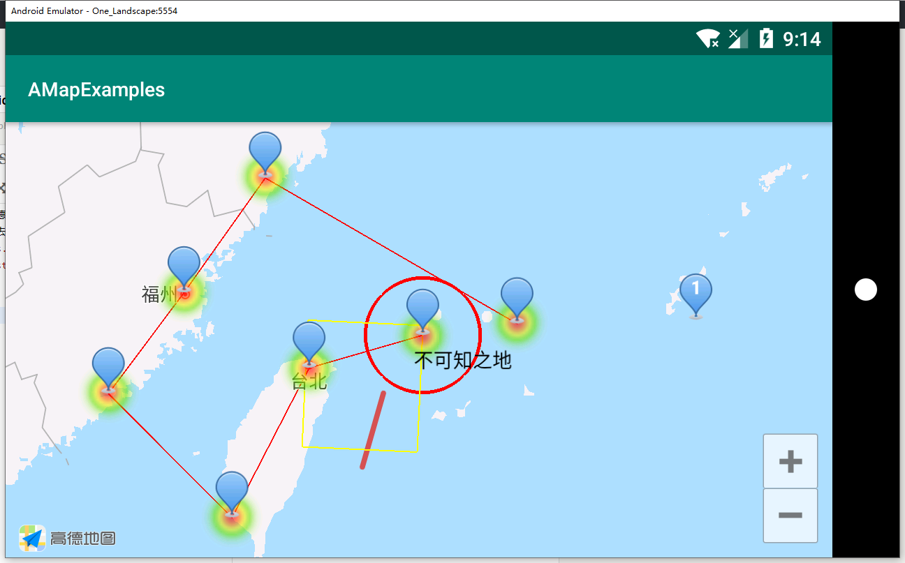

最近在学习高德地图SDK
最基础的配置去看高德官方的[SDK文档](https://lbs.amap.com/api/android-sdk/gettingstarted "SDK文档")

效果如图：


代码很简单，都写了注释
```java

    MapView mapView;

    @Override
    protected void onCreate(Bundle savedInstanceState) {
        super.onCreate(savedInstanceState);
        setContentView(R.layout.activity_main);

        mapView = findViewById(R.id.map);
        //必须
        mapView.onCreate(savedInstanceState);
        AMap aMap = mapView.getMap();

        List<LatLng> latLngList = getLatLngList();
        //移动相机到中心点,第二个参数是相机缩放倍数
        aMap.moveCamera(CameraUpdateFactory.newLatLngZoom(latLngList.get(0), 6));

        //画点
        for (LatLng latLng : latLngList) {
            aMap.addMarker(new MarkerOptions()
                    .icon(BitmapDescriptorFactory.defaultMarker(BitmapDescriptorFactory.HUE_AZURE))//图标，可以使用resId或者bitmap
                    //.icon(BitmapDescriptorFactory.fromResource(R.drawable.ic_launcher_background))
                    //.icon(BitmapDescriptorFactory.fromBitmap(null))
                    .position(latLng)//经纬坐标位置
                    .title("Title")//标题
                    .snippet("Snippet"))//子标题
            ;
        }

        //画线
        aMap.addPolyline(new PolylineOptions()
                .addAll(latLngList)//添加一个LatLng列表
                .color(Color.RED)//线条的颜色
                .width(2f)//线条的宽度
                .setDottedLine(false)//点线？虚线？
        );

        //画圆
        aMap.addCircle(new CircleOptions()
                //.fillColor(Color.TRANSPARENT)//圆圈的颜色，内部颜色
                .strokeColor(Color.RED)//圆圈的颜色
                .strokeWidth(5f)//圆圈的宽度
                .radius(100000d)//半径大小
                .center(latLngList.get(0))//中心点坐标
        );

        //自定义View的Marker标记
        LatLng unknownLatLng = new LatLng(25.026211, 124.189077);
        TextView textView = new TextView(this);
        textView.setTextColor(Color.BLACK);
        textView.setText("不可知之地");
        aMap.addMarker(new MarkerOptions().
                position(unknownLatLng)
                .icon(BitmapDescriptorFactory.fromView(textView))
        );

        //带自定义文本的Marker标记
        LatLng customizeLatLng = new LatLng(26.026211, 128.189077);
        Bitmap bitmap = BitmapDescriptorFactory.defaultMarker(BitmapDescriptorFactory.HUE_AZURE).getBitmap();
        Canvas canvas = new Canvas(bitmap);
        Paint paint = new Paint();
        paint.setColor(Color.WHITE);
        paint.setTextAlign(Paint.Align.CENTER);
        paint.setTextSize(25f);
        paint.setTypeface(Typeface.DEFAULT_BOLD);
        canvas.drawText("1", bitmap.getWidth() / 2, bitmap.getHeight() / 2, paint);
        aMap.addMarker(new MarkerOptions().icon(BitmapDescriptorFactory.fromBitmap(bitmap))
                .position(customizeLatLng));

        //画长方形
        aMap.addPolygon(new PolygonOptions()
                .add(new LatLng(25.745506, 123.459086))
                .add(new LatLng(23.745506, 123.459086))
                .add(new LatLng(23.745506, 121.459086))
                .add(new LatLng(25.745506, 121.459086))
                .fillColor(Color.TRANSPARENT)
                .strokeColor(Color.YELLOW)
                .strokeWidth(2f));

        //绘制热区
        HeatmapTileProvider provider = new HeatmapTileProvider.Builder()
                .data(latLngList)
                .build();
        aMap.addTileOverlay(new TileOverlayOptions()
                .tileProvider(provider));
    }

    @Override
    protected void onDestroy() {
        super.onDestroy();
        mapView.onDestroy();
    }

    @Override
    protected void onPause() {
        super.onPause();
        mapView.onPause();
    }

    @Override
    protected void onResume() {
        super.onResume();
        mapView.onResume();
    }

    @Override
    protected void onSaveInstanceState(Bundle outState) {
        super.onSaveInstanceState(outState);
        mapView.onSaveInstanceState(outState);
    }

    private List<LatLng> getLatLngList() {
        List<LatLng> latLngList = new ArrayList<>();
        /*
        先北纬后东经
        中心点：钓鱼岛:25.592319,123.463979
        台湾省台北市:24.996343,121.519399
        台湾省高雄市:22.563626,120.29991
        厦门：24.447478,118.058705
        福州：26.086712,119.289174
        温州：27.917085,120.607534
        赤尾屿：25.839774,125.089955
        不可知之地：25.026211,124.189077
         */
        latLngList.add(new LatLng(25.592319, 123.463979));
        latLngList.add(new LatLng(24.996343, 121.519399));
        latLngList.add(new LatLng(22.563626, 120.29991));
        latLngList.add(new LatLng(24.447478, 118.058705));
        latLngList.add(new LatLng(26.086712, 119.289174));
        latLngList.add(new LatLng(27.917085, 120.607534));
        latLngList.add(new LatLng(25.839774, 125.089955));
        return latLngList;
    }
```
