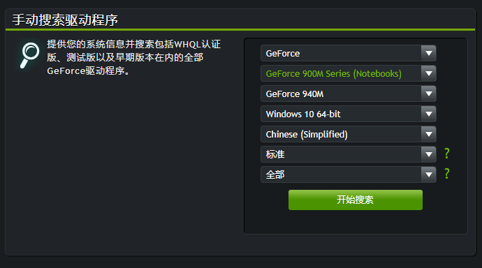
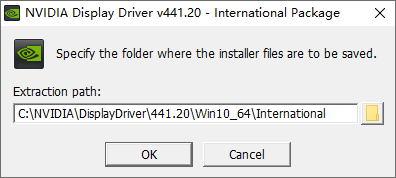
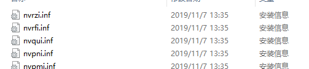
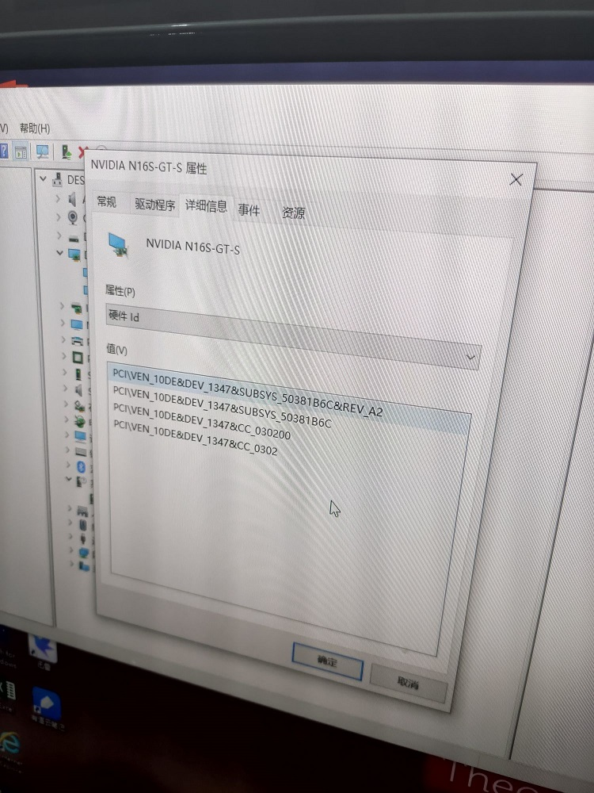
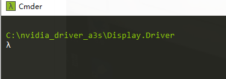
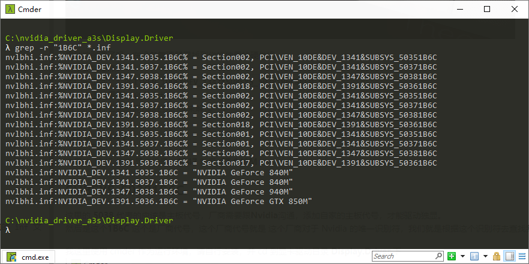
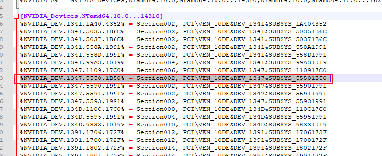
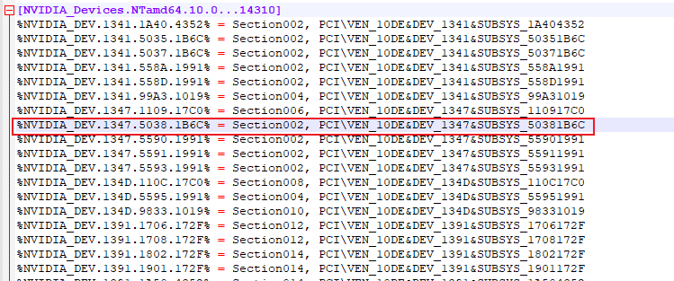
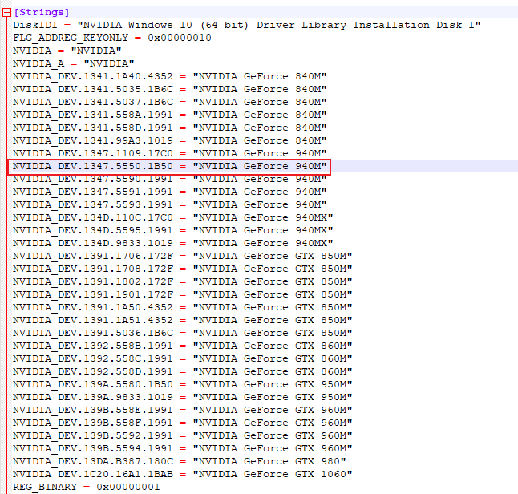
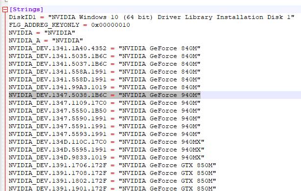

# 前言
博主近期收了一台笔记本：炫龙 A3S，i3-4000M以及GT 940M，这款独显在 Win10 下无法正常工作，会被识别成为：NVIDIA N16S-GT-S，这就是不兼容的结果，尝试修改 inf 文件后，成功驱动成 GT 940M。

# 操作过程

## 1. 下载 Nvdia 官方驱动
例如：**441.20-notebook-win10-64bit-international-whql-rp.exe**
https://www.geforce.cn/drivers


## 2. 修改驱动
 1. 解压驱动

比如我这里点击 **OK** 解压之后，将 **C:\NVIDIA\DisplayDriver** 复制一份出来，先不要点击安装

 2. 找到对应的 inf 配置文件,类似图片中的这些
 
网上的方法都是按照主板厂商来找，但是呢，这台笔记本的主板厂商我也不知道，也查不到，然后我了解到一个东西



看到这张图了吗，在设备管理器里找到你的独显的硬件ID
这里要划重点
我们定位到：**`PCI\VEN_10DE&DEV_1347&SUBSYS_50381B6C&REV_A2`**
这一串值很重要，必须找出来。
这个东西什么意思呢?现在我们就来解读一下

### DEV_1347
这里的 1347 代表 显卡代号，**1347** 就是 **GT 940M**
###SUBSYS_50381B6C
这里的 **5038** 代表的应该是主板代号，厂商需要跟**Nvidia**沟通，添加自家的主板代号，才能驱动独显。
然后是这个**1B6C** 这个是厂商代号，这个厂商代号就是 这个厂商对于 Nvidia 的唯一识别符，我们就是根据这个识别符去查找我们的 inf 文件。

我这里使用 cmder 作为运行环境，请自行安装，并 cd 到显卡驱动目录 **Display.Driver** 下


我们在这里先查找一下厂商的 inf 文件，你们需要把 **1B6C** 换成你的厂商代号

```cmd
grep -r "1B6C" *.inf
```

从结果可以看到：**nvlbhi.inf**，这个就是需要修改的文件了

我们使用 **Notepad++** 打开这个文件

搜索**NVIDIA_Devices.NTamd64.10**，这个是 Win10

然后我们再向下搜索 **1347** 显卡代号

我们修改这一行并把 **5550** 修改成 **5038**,把 **1B50** 修改成 **1B6C**
修改前

```
%NVIDIA_DEV.1347.5550.1B50% = Section002, PCI\VEN_10DE&DEV_1347&SUBSYS_55501B50
```

修改后

```
%NVIDIA_DEV.1347.5038.1B6C% = Section002, PCI\VEN_10DE&DEV_1347&SUBSYS_50381B6C
```


会发现有不止一个**NVIDIA_Devices.NTamd64.10**，我们就每一个的 **1347** 部分，添加我们的 **硬件ID** 过去，我这里修改了3处

然后我们定位到文件末尾的 **[Strings]** 部分，这里要增加一个我们显卡的显示名称

我们依然是修改这一行并把 **5550** 修改成 **5038**,把 **1B50** 修改成 **1B6C**，后面的名字应该可以自定义，我没有尝试。

然后我们保存文件

# 最后
最后就是 **禁用驱动签名**，打开 **setup.exe** 安装使用了
