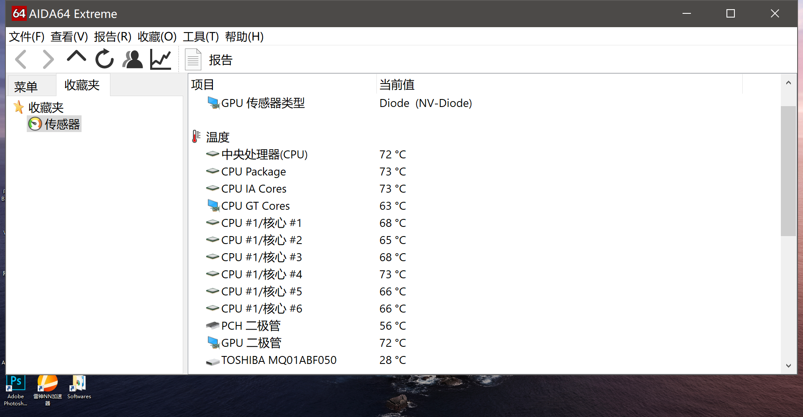
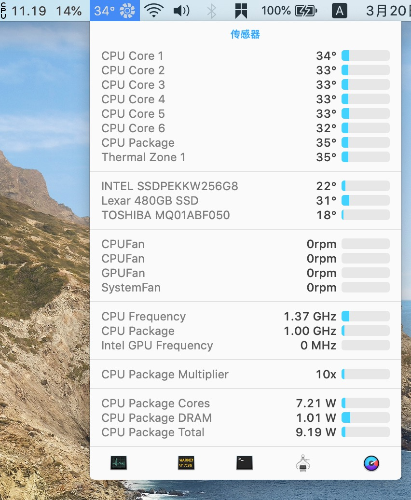

# 蓝天 NB50_60_TK1_TJ1 模具 硬改南桥散热，CPU显卡搭桥教程

由于我装了两条nvme的固态，所以主板南桥温度很高，开机70-80°C，高负载后90+°C，且温度很难降下来。强冷模式(Fn+1)也降不下来。所以必须对这台本子进行散热改造，我这里有4种可以达到散热的方式，目前我4者一起使用，效果很不错。

# 0. CPU 降压
可以先用XTU测试你的CPU降压多少合适，然后记得刷入我魔改的BIOS，不同CPU体质不同。我的大概能降150mv，切记选中减号，增压会导致CPU缩肛。

#### BIOS链接：[魔改BIOS](https://github.com/bavelee/NB5TK1_TJ1-BIOS "魔改BIOS")
#### 推荐刷入：**nb50tj1-b10718-unlocked-chipset-1080p-obsdian.fd**

我降压后，CPU温度比之前低了5度左右，还是有效果的。

# 1. 堵住进风口
**操作过程：**使用透明胶堵住D面 CPU和显卡的进风口(如图所示),并且将笔记本前面稍微垫高(我这里使用的是两颗象棋)，让风扇更好地从扬声器处进风，从而有一条风道经过南桥，达到降温的效果。

**效果：**开机后南桥70°C，使用强冷能保持南桥温度，不会上升太高，强冷状态下维持在60-90范畴，确实有降温效果，但是不是特别理想。

# 2. 使用硅胶垫，将温度导至键盘下贴片
 **操作过程：**购买一块硅胶片，不用太大，普通的南桥导热硅胶垫即可，放置在南桥背面和键盘下面铁片之间,这里需要将主板拆下。

** 效果：**配合第1种方法，两者结合，开机后南桥50-60°C，高负载情况下会有时候飙到80-90，开启强冷能保持在50-60，但是强冷太吵了。

# 3. 给南桥搭热管，顺便给CPU和显卡搭桥
 **操作过程：**此处需要成本，将近80块钱。
 
 ### 购买材料如下：

1. 信越7921原装版 3.5gx1
2. 硅脂垫x1
3. 8cm铜管x2
4. 南桥主板定制铜管x1

### 清理风扇灰尘

### 涂抹7921，并裁切主板中框

### 弯曲铜管让他贴着CPU铜管和南桥
**南桥需要先涂抹导热胶在放上金鱼片**

### 涂抹导热胶并固定

**放置重物固定90分钟后再装机**

** 效果：** 强烈推荐，效果太棒了，烤鸡、玩2小时吃鸡，南桥温度没有超过60，高负载下不开强冷也在60以下，在windows和macos下常规运行(浏览网页，看视频，聊天)听不见风扇生硬，具体情况可以看图。

CPU和主板搭桥，连续玩2小时吃鸡时，CPU和显卡温度没有超过70，大约在70-75之间徘徊，分担散热效果很赞。

### 刚开机温度

### 烤鸡五分钟温度

### 吃鸡半小时温度

### 吃鸡一个半小时温度

### 吃鸡两小时温度

# 其他截图
macos下低负载时温度截图

