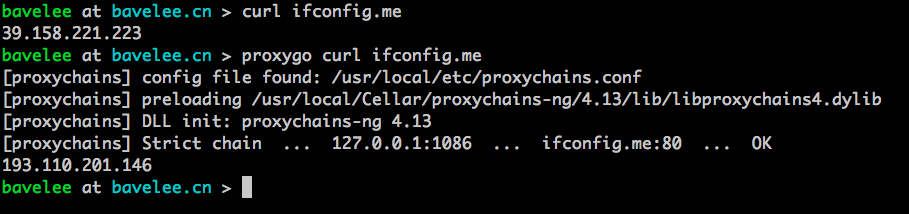

## 前言
在终端环境下，经常会遇到代理问题，代理不生效，或者某些程序不走代理，再或者就是代理不生效
```bash
fatal: unable to access 'https://github.com/LineageOS/android.git/': Content-Length: in 200 response
```
出现上面那种类似错误，就是代理不生效了

## 解决办法
使用 `proxychains` 对终端进行代理

## 安装

### 安装命令

- Ubuntu

```bash
sudo apt install proxychains
```
- macOS 

```bash
brew install proxychains-ng
```

### 配置代理
修改`/etc/proxychains.conf`文件内容为

macOS 文件在 `/usr/local/etc/proxychains.conf`

```conf
strict_chain
proxy_dns
tcp_read_time_out 15000
tcp_connect_time_out 8000
[ProxyList]
socks5 	127.0.0.1 43479
```

### 使用方式
添加一个 alias 到 .bashrc 中

```bash
alias proxygo='proxychains'
```

macOS 将 `proxycahins` 换成 `proxychains4`

### 测试

```bash
curl ifconfig.me
proxygo curl ifconfig.me
```

代理成功


