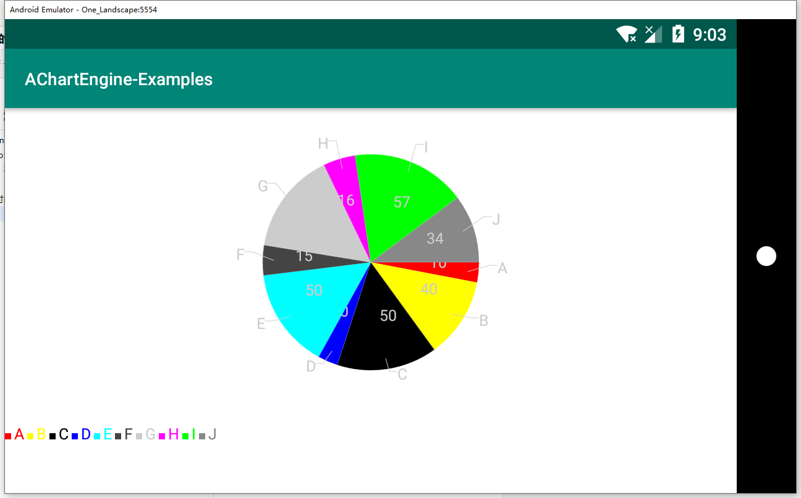

AChartEngine（简称ACE）是Google的一个开源图表库（for Android）。它功能强大，支持散点图、折线图、饼图、气泡图、柱状图、短棒图、仪表图等多种图表。

学习了一段时间，尝试写了三种图表的创建，写满了注释

源码下载：[AChartEngineExamples.zip](images/3265879968.zip)

效果如图:


#主要代码一览：

```java
	//创建柱状图
    private View createMultiSeriesBarChart(List<Double> dataList, List<Integer> colorList, List<String> titleList) {
        XYMultipleSeriesRenderer renderer = new XYMultipleSeriesRenderer();
        XYMultipleSeriesDataset dataSet = new XYMultipleSeriesDataset();

        //生成序列是获取数据中的最大最小值，用于决定y轴的起始值和结束值
        double max = 0;
        double min = 0;
        //遍历每个序列创建对应的series和renderer
        for (int i = 0; i < dataList.size(); i++) {
            int color = colorList.get(i);
            String title = titleList.get(i);

            XYSeriesRenderer r1 = new XYSeriesRenderer();
            XYSeries series = new XYSeries(title);

            //判断最大最小值
            double d = dataList.get(i);
            if (max < d)
                max = d;
            if (min > d)
                min = d;

            series.add(i, d);

            //颜色、文本大小、显示数值
            r1.setColor(color);
            r1.setChartValuesTextSize(25f);
            r1.setDisplayChartValues(true);
            //柱状图文本对齐方式
            r1.setChartValuesTextAlign(Paint.Align.CENTER);

            renderer.addSeriesRenderer(r1);
            dataSet.addSeries(series);
        }
        //设置x轴起始值和结束值,比临界值大一点可以更好的展示图表数据
        renderer.setXAxisMin(-1);
        renderer.setXAxisMax(dataList.size() + 1);

        //柱状图宽度
        renderer.setBarWidth(20f);
        //柱状图方向,横向的会导致图标拉伸
//        renderer.setOrientation(XYMultipleSeriesRenderer.Orientation.VERTICAL);
        //最大的和最小的值，比当前数值大10%…可以更好的展示图标数据
        renderer.setYAxisMax(max + max * 0.1);
        renderer.setYAxisMin(min - min * 0.1);
        //设置x,y轴的刻度数量
        renderer.setYLabels(8);
        renderer.setXLabels(dataList.size() + 3);
        //显示图例
        renderer.setShowLegend(true);
        //图例文本大小
        renderer.setLegendTextSize(25f);
        //设置不允许拖动
        renderer.setPanEnabled(false);
        //设置不允许缩放
        renderer.setZoomEnabled(false);
        //文本角度
        renderer.setXLabelsAngle(90);
        //设置背景色，两个方法必须一起调用
        renderer.setBackgroundColor(Color.WHITE);
        renderer.setApplyBackgroundColor(true);
        //边距颜色，默认是黑色
        renderer.setMarginsColor(Color.WHITE);
        //四周边距，对应上左下右,要么不填要么就填四个值
        renderer.setMargins(new int[]{50, 50, 50, 50});
        //文本大小
        renderer.setLabelsTextSize(25f);

        //BarChart.Type有两种
        //BarChart.Type.STACKED下图表上的文本对齐效果更好
        return ChartFactory.getBarChartView(this, dataSet, renderer, BarChart.Type.STACKED);
    }
	
	//创建折现图
    private View createLineChart(List<Double> dataList, int color, String seriesName) {
        //存放渲染器集合
        XYMultipleSeriesRenderer renderer = new XYMultipleSeriesRenderer();
        //存放数据集合，double数据
        XYMultipleSeriesDataset dataSet = new XYMultipleSeriesDataset();
        //单个渲染器
        XYSeriesRenderer r1 = new XYSeriesRenderer();
        //折现颜色(前景色)
        r1.setColor(Color.BLUE);
        //显示折现上的数值,模拟器上可能会有数值不显示
        r1.setDisplayChartValues(true);
        //数值文本大小
        r1.setChartValuesTextSize(25f);
        //线条宽度
        r1.setLineWidth(3f);
        //折线点大小
        r1.setPointStyle(PointStyle.CIRCLE);
        r1.setFillPoints(true);
        r1.setPointStrokeWidth(15f);

        //单个数据集
        XYSeries s1 = new XYSeries(seriesName);

        for (int i = 0; i < dataList.size(); i++) {
            //把数据放进数据系列对应(x, y)轴
            s1.add(i, dataList.get(i));
            //添加自定义标题，需要设hixLabels(0)
            renderer.addXTextLabel(i, "数据" + i);
        }

        //设置x轴起始值和结束值,比临界值大一点可以更好的展示图表数据
        renderer.setXAxisMin(-1);
        renderer.setXAxisMax(dataList.size() + 1);

        //获取数据中的最大最小值，用于决定y轴的起始值和结束值
        double max = Utils.maxInList(dataList);
        double min = Utils.minInList(dataList);
        //最大的和最小的值，比当前数值大10%…可以更好的展示图标数据
        renderer.setYAxisMax(max + max * 0.1);
        renderer.setYAxisMin(min - min * 0.1);
        //设置x,y轴的刻度数量
        renderer.setYLabels(8);
        renderer.setXLabels(0);

        //显示图例
        renderer.setShowLegend(true);
        //图例文本大小
        renderer.setLegendTextSize(25f);
        //设置不允许拖动
        renderer.setPanEnabled(false);
        //设置不允许缩放
        renderer.setZoomEnabled(false);
        //文本角度
        renderer.setXLabelsAngle(90);

        //设置背景色，两个方法必须一起调用
        renderer.setBackgroundColor(Color.WHITE);
        renderer.setApplyBackgroundColor(true);
        //边距颜色，默认是黑色
        renderer.setMarginsColor(Color.WHITE);
        //四周边距，对应上左下右,要么不填要么就填四个值
        renderer.setMargins(new int[]{50, 50, 50, 50});
        //文本大小
        renderer.setLabelsTextSize(25f);

        //添加渲染器和数据集到集合，两者数量必须相等
        renderer.addSeriesRenderer(r1);
        dataSet.addSeries(s1);

        return ChartFactory.getLineChartView(this, dataSet, renderer);
    }
	
	//创建饼图
    private View createMultiSeriesPieChart(List<Double> dataList, List<Integer> colorList, List<String> titleList) {
        DefaultRenderer renderer = new DefaultRenderer();
        CategorySeries categorySeries = new CategorySeries("PIE");


        //遍历每个序列创建对应的series和renderer
        for (int i = 0; i < dataList.size(); i++) {

            categorySeries.add(titleList.get(i), dataList.get(i));

            //饼图使用 SimpleSeriesRenderer
            SimpleSeriesRenderer r1 = new SimpleSeriesRenderer();
            r1.setColor(colorList.get(i));
            //设置value格式化输出为百分比，传入的值大于1会出问题
            //r1.setChartValuesFormat(NumberFormat.getPercentInstance());

            renderer.addSeriesRenderer(r1);
        }
        //显示标签
        renderer.setShowLabels(true);
        //显示数值
        renderer.setDisplayValues(true);
        //显示图例
        renderer.setShowLegend(true);
        //图例文本大小
        renderer.setLegendTextSize(25f);
        //设置不允许拖动
        renderer.setPanEnabled(false);
        //设置不允许缩放
        renderer.setZoomEnabled(false);
        //设置背景色，两个方法必须一起调用
        renderer.setBackgroundColor(Color.WHITE);
        renderer.setApplyBackgroundColor(true);
        //边距颜色，默认是黑色
        //四周边距，对应上左下右,要么不填要么就填四个值
        renderer.setMargins(new int[]{50, 50, 50, 50});
        //文本大小
        renderer.setLabelsTextSize(25f);

        return ChartFactory.getPieChartView(this, categorySeries, renderer);
    }
```
