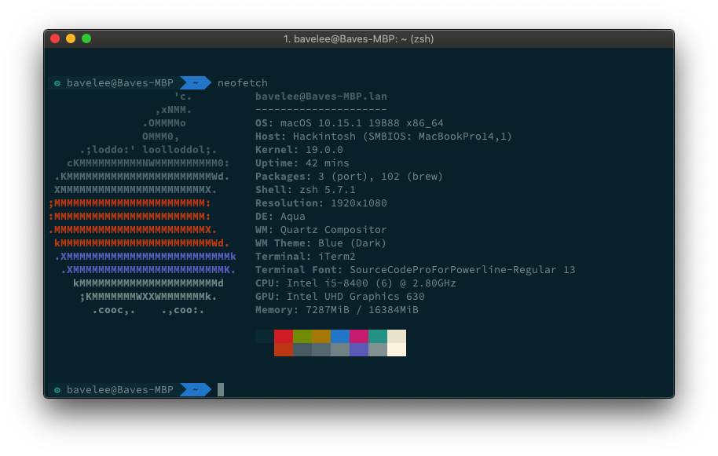
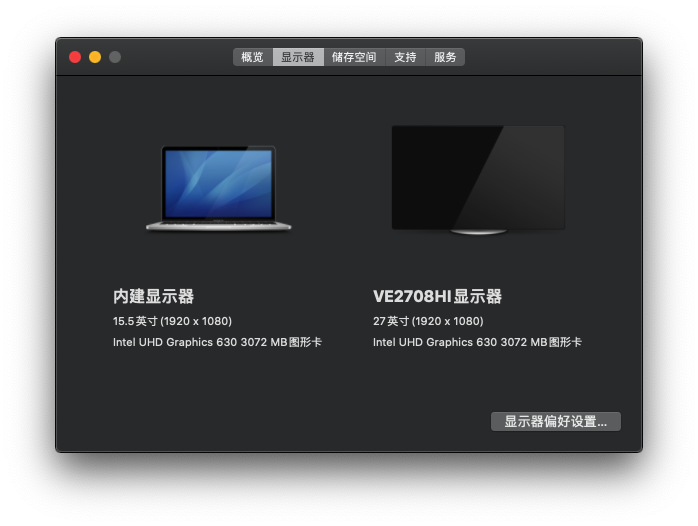
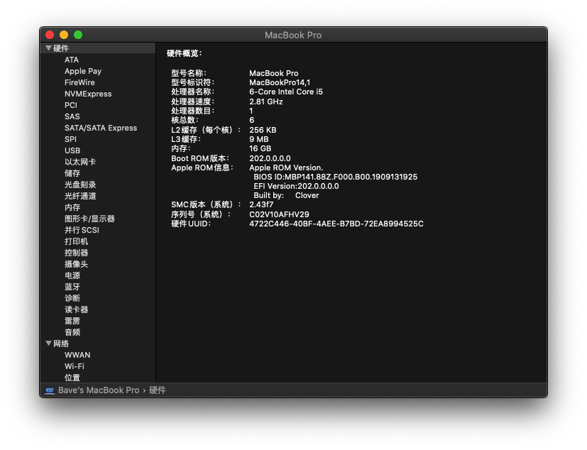

# 炫龙DC2 DD2 NB50/60 TJ1/TK1 模具 黑苹果EFI配置 i5-8400 UHD630

### QQ 交流群 ： 181587932 (已入无界16Pro，不再更新)

### 已入无界16Pro，不再更新

### 已入无界16Pro，不再更新

### 已入无界16Pro，不再更新

# 注意事项

0. 如果你来这里找安装教程，请绕道
1. 本站不提供黑苹果安装教程，也不会回答安装过程中的问题，请自行学习，如今黑苹果安装已经非常便利简单，且网上提供有大量教程，不愿学习者请自行绕道。
2. 本站只提供 EFI ，安装过程、使用过程出现任何问题，本人概不负责，望知悉。
3. 推荐一个非常棒的[黑苹果入手教程](https://github.com/dortania)，这篇教程非常好非常全面但是大部分东西还没有翻译成中文，但是依然建议观看学习。
4. 好多人会来问独显的问题，不关你的显卡是 GTX1050、GTX1050Ti 还是 GTX1060等等，独显在10.13.16下可以驱动，但是驱动了也没用只是摆设，因为本模具走核显输出，macOS不支持“**独显计算核显输出**”的技术，macOS 下只能用核显。
5. 尽量不要通过 OpenCore 或者 Clover 去启动 Windows，通过这两个引导启动都会造成系统不稳定或者开不了机，因为修改了DSDT/SSDT
6. 使用 OpenCore 说直接进 Windows 的、还有不显示引导菜单的，麻烦认真看看白果快捷键，不看请自行离开

# 配置清单

请不要问“**我的配置能否安装**”等诸如此类的问题，自行对照配置清单，自行尝试安装。

### 适用机型

* 不适用

  - 奔腾处理器
  - 核显非UHD630
  - 十代 CPU
  - HD 630 (HD630不是UHD630)
    8 代 U 和 9 代 U 核显皆为 UHD 630，可通用，非 UHD 630 不可使用，10 代 U 亦不可使用
* 目前已知可用笔记本型号


| 模具    | 型号列表                                                                                                                                                                                                                                                                                                                                                                                   |
| --------- | -------------------------------------------------------------------------------------------------------------------------------------------------------------------------------------------------------------------------------------------------------------------------------------------------------------------------------------------------------------------------------------------- |
| NB50TJ1 | 炫龙毁灭者DCⅡ-8480S2N 炫龙DCⅡ-8481S2N 炫龙毁灭者DCⅡ-5481S1N 炫龙毁灭者DCⅡ-5480S2N 炫龙毁灭者DCⅡ-5440S2N 炫龙毁灭者DCⅡ-8181S1N 战神K670D-G4D5 战神K670E-G6D3 战神K670E-G6E3 战神K670D-G4E5 战神K670D-G4T 战神K670E-G6T3 V2.0 战神K670E-G6T3 海鲅天启K1                                                                                                                                |
| NB50TK1 | 炫龙毁灭者DDⅡ-8481S2N 炫龙毁灭者DDⅡ-8181S1N 炫龙毁灭者DDⅡ-5480S2N 炫龙DDⅡ-8480S5N畅玩版 炫龙DDⅡ-8481S2N 炫龙DDⅡ-5480S2N畅玩版 炫龙毁灭者DDⅡ-8411S1N 炫龙毁灭者DDⅡ-8481S1N 战神ZX6-CT5H2 超级战神ZX6-CP5T1 超级战神ZX6-CP5A1 超级战神ZX6-CP5T 战神K680E-G6E3 战神K680E-G6D3 超级战神ZX6-CP5S 战神K680E-G4E4 战神K680E-G4D4 战神K680E-G6T3 战神ZX6-CT5A2 战神K680E-G6 战神K680E-G4T4 |
| NB60TK1 | 炫龙DD2 Plus-5280S2Q 战神 K670T-G6A1 战神 K670T-G4A1 麦本本黑6 天宝X9S                                                                                                                                                                                                                                                                                                                     |
|         | 神舟战神 ZX7CP5SC                                                                                                                                                                                                                                                                                                                                                                          |

### 理论适用的 macOS  版本

##### 注：只更新、只适配、只测试最新系统

- Big Sur 11.x (20B29)
- Catalina 10.15.x
- Mojave 10.14.x
- High Sierra 10.13.x

![BigSur.png][1]

### 博主笔记本配置


| 规格     | 详细信息                          |
| ---------- | ----------------------------------- |
| 电脑型号 | 炫龙毁灭者 DCⅡ-5481S1N           |
| 操作系统 | macOS Big Sur 11.1 (20B29)        |
| 处理器   | Intel Core i5-8400 @ 2.81GHz 六核 |
| 内存     | 16 GB 2667 MHz DDR4               |
| 硬盘     | Intel 760P SSD 256 GB PCIE NVME   |
| 显卡     | Intel UHD Graphics 630 2048 MB    |
| 网卡     | Intel AC9560                      |
| 声卡     | ALC269VC                          |
| SMBIOS   | MacBookPro15,4                    |

# 当前硬件实现功能

* ✅ CPU 睿频变频
* ✅ 核显 UHD630 显存 2048MB
* ✅ 硬件加速 4K HEVC/H.265解码
* ✅ USB3.0 USB2.0 Type-C
* ✅ 声卡 SSDT 完美内建 layout-id 为 29
* ✅ 电池状态与电量百分比
* ✅ 亮度调节与亮度保存
* ✅ 睡眠唤醒
* ✅ 节能五项
* ✅ 有线网卡
* ✅ 无线网卡
* ✅ 蓝牙正常

### HDMI视频+音频(内外屏皆可工作+热拔插)


|     使用情况     | 外屏 | 内屏 | 热拔插 | 睡眠 | 花屏 |      开机时      |
| :-----------------: | :----: | :----: | :------: | :----: | :----: | :----------------: |
| 开机时开盖+接HDMI |  ✅  |  ✅  |   ✅   |  ✅  |  ✅  | 第二阶段短暂黑屏 |
| 开机时合盖+接HDMI |  ✅  |  ✅  |   ✅   |  ✅  |  ❌  |      无异常      |
|   开机后接HDMI   |  ✅  |  ✅  |   ✅   |  ✅  |  ✅  |      无异常      |
|    不适用HDMI    |  ✅  |  ✅  |   ✅   |  ✅  |  ✅  |      无异常      |

### 白果快捷键


| macOS 的功能键 | 对应按键      |
| :--------------: | :-------------- |
|    Command    | Windows徽标键 |
|     Option     | Alt           |
|    Control    | Ctrl          |

**Cmd+V**: 日志模式
**Cmd+Opt+P+R**: 清除 NVRAM
**Cmd+R**: 启动 Recovery 模式
**Cmd+S**: 启动单用户模式
**Option/Alt**: 显示引导菜单

**Cmd** 对应笔记本键盘上的 **Win 键**，所以你可以用 **Win + V **进入啰嗦模式，**Alt** 进入引导选择界面
按键方法：笔记本第一屏亮起时按住对应热键不松开，直到功能打开
在OC引导界面时，使用 **Ctrl+Enter** 设置默认启动项，未设置默认启动项时，一般默认启动的是 Windows

# 存在的问题

* ❌ 遇到电池不正常的问题，清除NvRAM(重置EC)
* ❌ ~~DD2/ZX6CP5S1 机型存在偶发重启问题(开机进入macOS后手动重启一次解决)，原因不明，其他同模具机型无此问题~~
* ❌ MiniDP 由独显输出，无法使用
* ❌ 独显不能驱动不能用，谁再问谁没XX

# 更新日志

* 更新到 `OpenCore` 官方版 `0.6.6`, MOD版更新不方便已抛弃
* 本次更新主要解决 1080p 开机黑屏的问题
* 有几点我强调一下,只适配最新系统,而且没事别乱求更新,我不会回头去管旧版本,尤其是要装10.13的请勿使用本EFI
* 默认配置文件 1080p, 4K 屏用户请使用 `config_4k.plist`
* 自带了 Intel 的 WiFi 和 蓝牙 驱动，可正常使用
* 默认显示引导菜单，避免某些睿智不知道如何打开
* Kexts 更新到最新版
* 更新`VoodooPS2` 可支持手势,此版本为我自行编译修改版，官方版不能使用触摸版的物理按键(源码中将 `isthinkpad` 设置为1)

# 常见问题

### 1.解决 macOS 和 Windows 时间同步

此命令在 Windows 命令行中运行

```shell
Reg add HKLM\SYSTEM\CurrentControlSet\Control\TimeZoneInformation /v RealTimeIsUniversal /t REG_DWORD /d 1
```

### 2.重建 Kexts 缓存

```shell
sudo rm /System/Library/PrelinkedKernels/prelinkedkernel
sudo rm /System/Library/Caches/com.apple.kext.caches/Startup/kernelcache
sudo chmod -R 755 /System/Library/Extensions
sudo chmod -R 755 /Library/Extensions
sudo chown -R root:wheel /System/Library/Extensions
sudo chown -R root:wheel /Library/Extensions
sudo touch /System/Library/Extensions
sudo touch /Library/Extensions
sudo kextcache -q -update-volume /
sudo kextcache -system-caches
sudo kextcache -i /
```

### 3.允许安装任何来源软件

```shell
sudo spctl --master-disable
```

### 4.清除NvRAM / 重置EC

1. 请先移除电源适配器(笔记本使用电池供电)
2. 关机状态下按住** `Fn + D + 电源按钮`**
3. 键盘亮松开电源键，保持** `Fn + D `**按住
4. 出现第一屏松开** `Fn + D `**
5. 笔记本屏幕黑屏，按下回车键
6. 弹出 CMOS 提示，再次按下回车键
7. 电脑自动关机，需手动开机
8. NvRAM / EC 已重置

# 截图一览



## 内屏外屏



## 硬件信息



# 如果你觉得本文及EFI对你有所帮助，可以在本文下方“赞赏”捐赠作者

# 下载地址

### 请尽量加群获取最新信息，博客不定时更新，群文件有最新版本

### QQ 交流群 ： 181587932

已入无界16Pro，不再更新

[最新 EFI 下载](https://github.com/bavelee/NB5TK1_TJ1-Hackintosh/releases)
[Clover_EFI_20191107(停更).zip](https://github.com/bavelee/NB5TK1_TJ1-Hackintosh/archive/20191107.zip)

[1]: images/338602416.png

