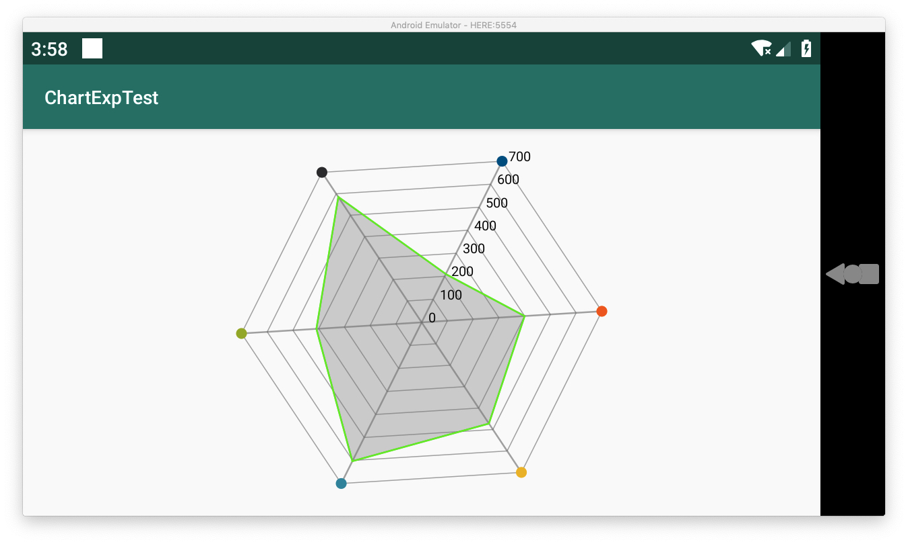

需要在雷达图的定点上画点，但是百度谷歌都没有发现有解决办法，所以研究源码发现可以通过重写Renderer实现画点
效果如下图

五个顶点上需要画上小圆点

#### 原理分析
雷达图图表在设置好数据开始绘制时，会调用进行`canvas.drawLine()`进行连线
于是可以定位到`RadarChartRenderer`的onDrawWeb下的如下代码
```java
   MPPointF p1out = MPPointF.getInstance(0,0);
        MPPointF p2out = MPPointF.getInstance(0,0);
        for (int j = 0; j < labelCount; j++) {

            for (int i = 0; i < mChart.getData().getEntryCount(); i++) {

                float r = (mChart.getYAxis().mEntries[j] - mChart.getYChartMin()) * factor;

                Utils.getPosition(center, r, sliceangle * i + rotationangle, p1out);
                Utils.getPosition(center, r, sliceangle * (i + 1) + rotationangle, p2out);
				
				//这里就是他的连线
                c.drawLine(p1out.x, p1out.y, p2out.x, p2out.y, mWebPaint);
            }
        }
        MPPointF.recycleInstance(p1out);
        MPPointF.recycleInstance(p2out);
```
于是乎我们可以知道所有网格交叉顶点的位置
重写`RadarChartRenderer`就可以实现在顶点画圆点了
#### 主要修改的代码是
```java
 //重写Renderer实现画点
        chart.setRenderer(new RadarChartRenderer(chart, chart.getAnimator(), chart.getViewPortHandler()) {
            @Override
            protected void drawWeb(Canvas c) {
                super.drawWeb(c);
                float sliceangle = mChart.getSliceAngle();
                float factor = mChart.getFactor();
                float rotationangle = mChart.getRotationAngle();

                MPPointF center = mChart.getCenterOffsets();

                int labelCount = mChart.getYAxis().mEntryCount;

                MPPointF p1out = MPPointF.getInstance(0, 0);

                for (int i = 0; i < mChart.getData().getEntryCount(); i++) {

                    //原来的是float r = (mChart.getYAxis().mEntries[i] - mChart.getYChartMin()) * factor;
                    //我们只需要给最外面一层网格画圆点,最外层的就是labelCount - 1
                    //r是最外面点的半径
                    float r = (mChart.getYAxis().mEntries[labelCount - 1] - mChart.getYChartMin()) * factor;

                    //这就是根据中心点、半径、角度计算位置
                    //具体可以看源码中的drawWeb(Canvas c)
                    //从源码里修改而来
                    Utils.getPosition(center, r, sliceangle * i + rotationangle, p1out);

                    //设置画笔
                    Paint paint = new Paint(mWebPaint);
                    paint.setStyle(Paint.Style.FILL);
                    paint.setColor(colors.get(i));
                    c.drawCircle(p1out.x, p1out.y, 8, paint);
                }
                MPPointF.recycleInstance(p1out);
            }
        });
```
#### 原版的drawWeb

#### 完整代码
```java
    @Override
    protected void onCreate(Bundle savedInstanceState) {
        super.onCreate(savedInstanceState);
        setContentView(R.layout.activity_main);
        RadarChart chart = (RadarChart) findViewById(R.id.chart);

        //颜色列表
        final List<Integer> colors = new ArrayList<>();
        colors.add(Color.parseColor("#005792"));
        colors.add(Color.parseColor("#fd5f00"));
        colors.add(Color.parseColor("#eec60a"));
        colors.add(Color.parseColor("#2694ab"));
        colors.add(Color.parseColor("#96C120"));
        colors.add(Color.parseColor("#383639"));


        List<RadarEntry> entries = new ArrayList<>();

        Random random = new Random();
        for (int i = 0; i < colors.size(); i++) {
            //生成200-501之内的随机数
            entries.add(new RadarEntry(random.nextInt(450) + 200));
        }
        //绑定数据集
        RadarDataSet set1 = new RadarDataSet(entries, "SET 1");
        RadarData data = new RadarData(set1);
        //不绘制网格上的值
        data.setDrawValues(false);
        //设置网格颜色
        set1.setColor(Color.GREEN);
        //设置填充色
        set1.setFillColor(Color.GRAY);
        //允许填充颜色
        set1.setDrawFilled(true);

        XAxis x = chart.getXAxis();
        //不显示x轴标签
        x.setDrawLabels(false);

        YAxis y = chart.getYAxis();
        //设置y轴从0开始
        y.setAxisMinimum(0);

        Legend l = chart.getLegend();
        //关闭图例
        l.setEnabled(false);
        Description d = chart.getDescription();
        //关闭描述
        d.setEnabled(false);

        //设置四周边距
        chart.setExtraOffsets(10, 10, 10, 10);

        //重写Renderer实现画点
        chart.setRenderer(new RadarChartRenderer(chart, chart.getAnimator(), chart.getViewPortHandler()) {
            @Override
            protected void drawWeb(Canvas c) {
                super.drawWeb(c);
                float sliceangle = mChart.getSliceAngle();
                float factor = mChart.getFactor();
                float rotationangle = mChart.getRotationAngle();

                MPPointF center = mChart.getCenterOffsets();

                int labelCount = mChart.getYAxis().mEntryCount;

                MPPointF p1out = MPPointF.getInstance(0, 0);

                for (int i = 0; i < mChart.getData().getEntryCount(); i++) {

                    //原来的是float r = (mChart.getYAxis().mEntries[i] - mChart.getYChartMin()) * factor;
                    //我们只需要给最外面一层网格画圆点,最外层的就是labelCount - 1
                    //r是最外面点的半径
                    float r = (mChart.getYAxis().mEntries[labelCount - 1] - mChart.getYChartMin()) * factor;

                    //这就是根据中心点、半径、角度计算位置
                    //具体可以看源码中的drawWeb(Canvas c)
                    //从源码里修改而来
                    Utils.getPosition(center, r, sliceangle * i + rotationangle, p1out);

                    //设置画笔
                    Paint paint = new Paint(mWebPaint);
                    paint.setStyle(Paint.Style.FILL);
                    paint.setColor(colors.get(i));
                    c.drawCircle(p1out.x, p1out.y, 8, paint);
                }
                MPPointF.recycleInstance(p1out);
            }
        });

        chart.setData(data);
    }

```
