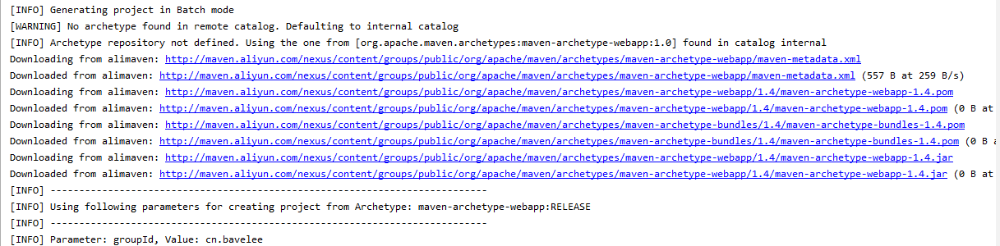

1. 进入目录：**`C:\Program Files\JetBrains\IntelliJ IDEA 2019.2.3\plugins\maven\lib\maven3\conf`**

2. 打开文件**`settings.xml`**

3. 找到**`<mirrors>`**标签

4. 在**`<mirrors>`**标签内插入如下内容
```xml
	 <mirror>
      <id>alimaven</id>
      <name>aliyun maven</name>
      <url>http://maven.aliyun.com/nexus/content/groups/public/</url>
      <mirrorOf>central</mirrorOf>        
	</mirror>
```

5. 然后就可以看到控制台里显示在阿里的源同步maven了


