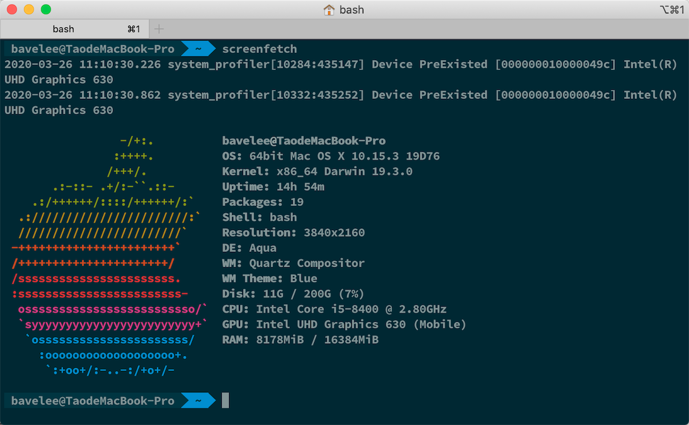

# macOS 下安装并配置 iTerm2

## 推荐看这篇：[https://github.com/sirius1024/iterm2-with-oh-my-zsh](https://github.com/sirius1024/iterm2-with-oh-my-zsh)
## 1. 安装 iTerm2.app
 官方网站：[https://www.iterm2.com/](https://www.iterm2.com/ "https://www.iterm2.com/")

## 2. 安装 Oh-my-bash (不是oh-my-zsh)
```bash
# 使用 brew 安装新版本 bash
brew install bash
# 替换系统 bash
sudo mv /bin/bash /bin/bash.origin
sudo ln -s /usr/local/opt/bash/bin/bash /bin/bash
echo 'source ~/.bashrc' >> ~/.bash_profile
chsh -s /bin/bash
# 运行一键安装 oh-my-bash
sh -c "$(curl -fsSL https://raw.githubusercontent.com/ohmybash/oh-my-bash/master/tools/install.sh)"
```

## 3. 安装 powerline 字体
### 安装字体
```bash
git clone https://github.com/powerline/fonts.git --depth=1
cd fonts
./install.sh
cd ..
rm -rf fonts
```
### 应用字体
打开 `iTerm2` - `Preferences` - `Profiles` - `Text` 如图修改`Font`、`Non-ASCII Font`


## 4. 替换主题为 agnoster
```bash
sed -i "" "s#OSH_THEME=.*#OSH_THEME=\"agnoster\"#" ~/.bashrc
source ~/.bashrc
```
## 5. 使用 Solarized 配色
### 安装 Solarized 配色
```bash
curl -fSSL https://github.com/altercation/solarized/raw/master/iterm2-colors-solarized/Solarized%20Light.itermcolors -o light.itermcolors
curl -fSSL https://github.com/altercation/solarized/raw/master/iterm2-colors-solarized/Solarized%20Dark.itermcolors -o dark.itermcolors
open light.itermcolors
open dark.itermcolors
```
### 应用配色
 打开 `iTerm2` - `Preferences` - `Profiles` - `Colors` - `Color Presets` 选择 `dark`


## 6. 设置 iTerm2 为默认终端


## 7. 最终效果图

