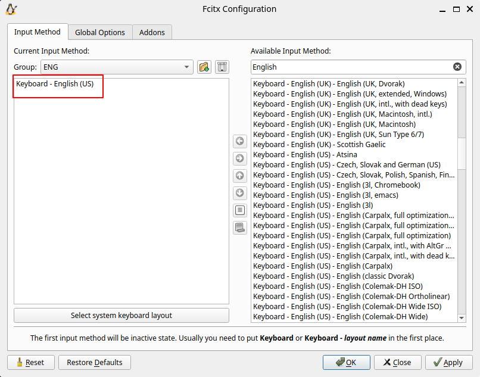
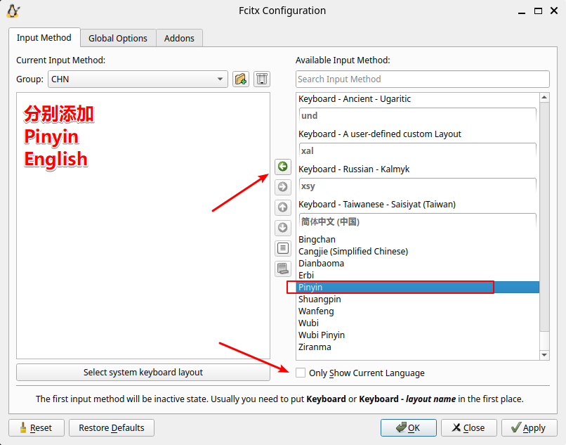
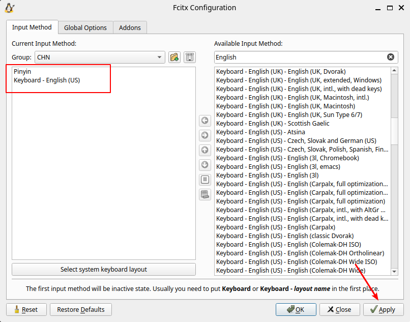
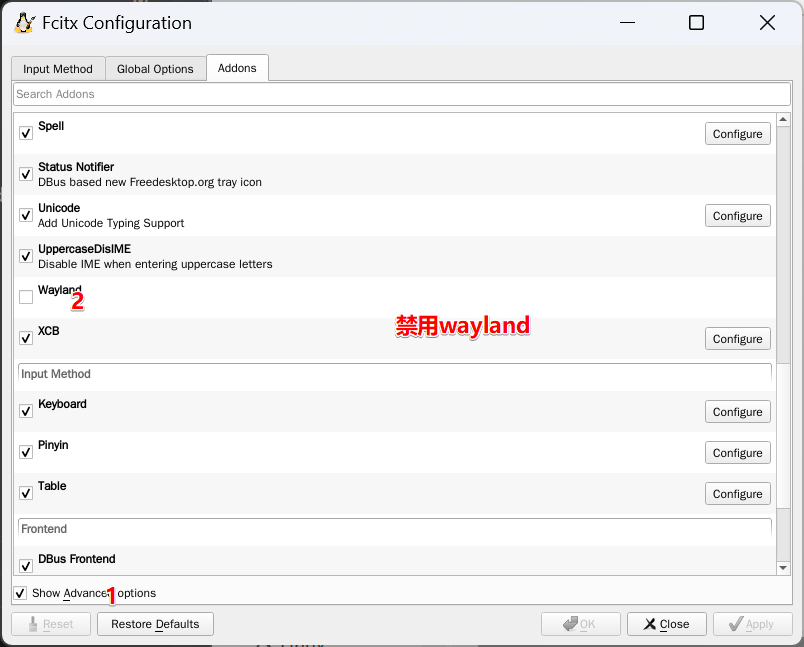
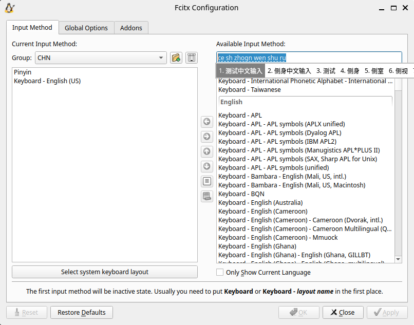
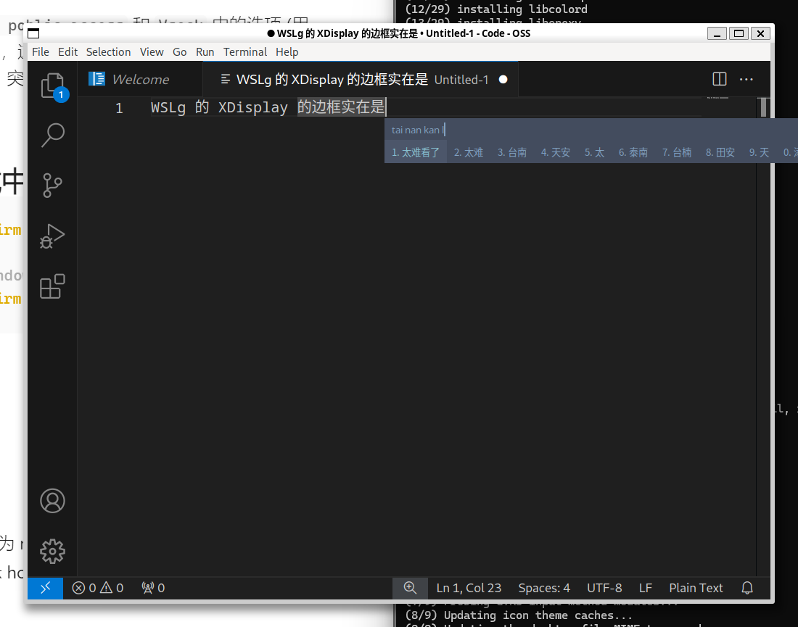
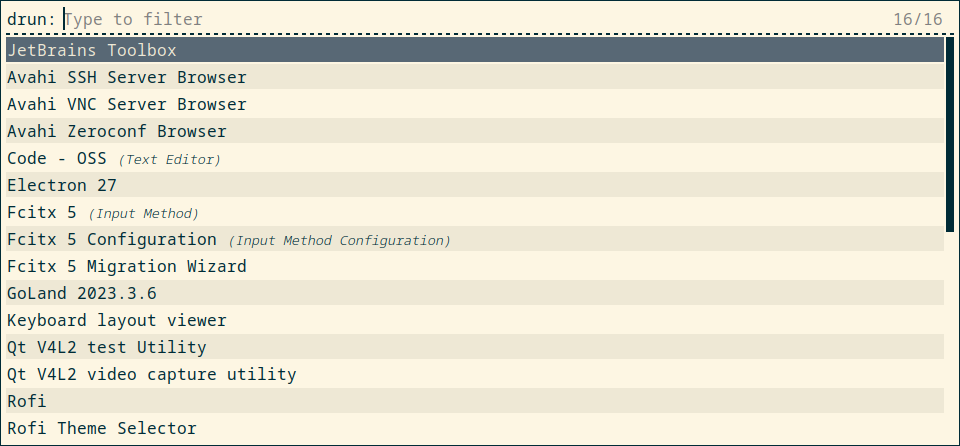

# 前言
本文按照作者个人使用习惯，记录自己在 `Windows 11` 中搭建 `WSL`配合`XServer` 的开发环境。作者基本使用过所有的`Linux DE (Linux 桌面环境)`，`Hackintosh` 也使用过四年，桌面体验最佳的一直都是 `Windows`，个人观点。

## 当下的 `Linux` 桌面环境弊端：
1. 界面丑，虽然自定义程度都高，主题多，但是最诟病的是风格统一问题，即便是默认主题，不协调的地方也让人难受。
2. `Wayland` 极其不稳定且软件生态差，尤其是远程协助类的软件。
3. 缺少国内毒瘤软件的支持，即便是QQ出了NT、微信出了正统Linux版本、钉钉出了半成品，但还是差太多。
## 本文目的
1. `DBus`不正常工作的问题，以及多会话 `DBus`共享问题
2. 中文输入以及 `Fcitx5` 自启动问题
3. 解决`WSL`在网络变更时导致的`X Windows`消失的问题
4. 按照我的个人习惯，配置 `WSL2`开发环境
5. 记录自己遇到的并解决的坑
6. 不是新手向的教程，需要有 `WSL2`的安装经验更好阅读
# Windows 下的配置
## 更新 WSL 到最新版本
```powershell
$ wsl --update
$ wsl --version
WSL 版本： 2.1.5.0
内核版本： 5.15.146.1-2
WSLg 版本： 1.0.60
MSRDC 版本： 1.2.5105
Direct3D 版本： 1.611.1-81528511
DXCore 版本： 10.0.25131.1002-220531-1700.rs-onecore-base2-hyp
Windows 版本： 10.0.22631.3296
```
## 修改 .wslconfig
> - `C:\Users\xxx\.wslconfig`
> - 修改后需要重启 WSL
```bash
[wsl2]
autoProxy=false             # 是否强制 WSL2/WSLg 子系统使用 Windows 代理设置（请根据实际需要启用）
dnsTunneling=true           # WSL2/WSLg DNS 代理隧道，以便由 Windows 代理转发 DNS 请求（请根据实际需要启用）
firewall=true               # WSL2/WSLg 子系统的 Windows 防火墙集成，以便 Hyper-V 或者 WPF 能过滤子系统流量（请根据实际需要启用）
guiApplications=true        # 启用 WSLg GUI 图形化程序支持
ipv6=true                   # 启用 IPv6 网络支持
nestedVirtualization=true   # 启用 WSL2/WSLg 子系统嵌套虚拟化功能支持
networkingMode=mirrored     # 启用镜像网络特性支持

[experimental]
autoMemoryReclaim=gradual
sparseVhd=true              # 启用稀疏磁盘文件
ignoredPorts=22             # 镜像网络下忽略掉 WSL 的 ssh 端口
hostAddressLoopback=true    # 镜像网络下允许宿主机与WSL通过回环地址互访
useWindowsDnsCache=false         # 和 dnsTunneling 配合使用，决定是否使用 Windows DNS 缓存池
```

## 配置 Hyper-V 防火墙
> - 允许入站连接，不设置此项会导致其他机器无法访问宿主机中的WSL的端口
```powershell
Set-NetFirewallHyperVVMSetting -Name ‘{40E0AC32-46A5-438A-A0B2-2B479E8F2E90}’ -DefaultInboundAction Allow
```

## 配置 Hyper-V 动态端口范围
> - Hyper-V 会保留占用一部分端口，我要在WSL里装docker，避免端口冲突
> - 遇到过的问题就是 `npm run` 的随机端口提示被占用
```powershell
netsh int ipv4 set dynamic tcp start=49152 num=16384
netsh int ipv6 set dynamic tcp start=49152 num=16384
```

# 安装 ArchWSL
> - 跟随下方链接教程，安装好 `ArchWSL` 后启动
> - [https://wsldl-pg.github.io/ArchW-docs/How-to-Setup/](https://wsldl-pg.github.io/ArchW-docs/How-to-Setup/)

## 创建 Arch Linux 的普通用户
> - 注意替换为你的用户名
```bash
USERNAME=rayae
echo "%wheel ALL=(ALL) ALL" > /etc/sudoers.d/wheel
useradd -m -G wheel -s /bin/bash $USERNAME
passwd $USERNAME
su - $USERNAME
```

## 配置 sudo 无需输入密码
> - 看个人喜好，我不喜欢 sudo 输入密码，只用来提权
> - 注意: 此步骤在普通用户下执行
```bash
sudo chmod +w /etc/sudoers
echo "$USER ALL=(ALL:ALL) NOPASSWD: ALL"| sudo tee -a /etc/sudoers && sudo chmod -w /etc/sudoers
```

## 修改默认用户并开启 systemd
```bash
echo "[user]
default=$USER

[boot]
systemd=true

[network]
generateHosts=true
generateResolvConf=true

[interop]
appendWindowsPath=false
" | sudo tee /etc/wsl.conf
```

## 重启 WSL
> - 注意需要在 CMD 或者 PowerShell 下执行
```powershell
wsl --shutdown
```
# 配置 Arch Linux
## 配置 Pacman
> 重启之后重新进入 WSL
### 1. 配置 pacman 密钥
> - 参考自：[https://wsldl-pg.github.io/ArchW-docs/How-to-Setup/](https://wsldl-pg.github.io/ArchW-docs/How-to-Setup/)
```bash
sudo pacman-key --init && sudo pacman-key --populate

# 备份原有镜像
sudo mv /etc/pacman.d/mirrorlist /etc/pacman.d/mirrorlist.orgi
# 使用校园网联合镜像
echo 'Server = https://mirrors.cernet.edu.cn/archlinux/$repo/os/$arch'| sudo tee /etc/pacman.d/mirrorlist
# 刷新数据库
sudo pacman -Syyu --noconfirm
```

### 2. 配置 pacman 加速镜像
> - 校园网联合镜像：[https://help.mirrors.cernet.edu.cn/archlinux/](https://help.mirrors.cernet.edu.cn/archlinux/)
> - Arch Linux镜像配置：[https://wiki.archlinux.org/title/mirrors](https://wiki.archlinux.org/title/mirrors)
```bash
# 选取 6 个速度最快的镜像
sudo pacman -S pacman-contrib --noconfirm

## 有镜像备份(mirrorlist.orgi)执行
rankmirrors -n 6 /etc/pacman.d/mirrorlist.orgi | sudo tee /etc/pacman.d/mirrorlist

# 刷新数据库
sudo pacman -Syy --noconfirm
```

#### 如果你没镜像备份
```bash
## 无镜像备份执行
curl -s "https://archlinux.org/mirrorlist/?country=CN&protocol=https&use_mirror_status=on)" | sed -e 's/^#Server/Server/' -e '/^#/d' | rankmirrors -n 6 - | sudo tee /etc/pacman.d/mirrorlist

# 刷新数据库
sudo pacman -Syy --noconfirm
```
### 3. 配置 ArchLinuxCN 镜像源
> - 参考链接：[https://help.mirrors.cernet.edu.cn/archlinuxcn/](https://help.mirrors.cernet.edu.cn/archlinuxcn/)

```bash
echo '
[archlinuxcn]
Server = https://mirrors.cernet.edu.cn/archlinuxcn/$arch' | sudo tee -a /etc/pacman.conf
sudo pacman-key --lsign-key "farseerfc@archlinux.org"
sudo pacman -Syy archlinuxcn-keyring --noconfirm
```

## 安装基本工具
> - 注意：此处从 ArchLinuxCN 源中安装了 yay
```bash
sudo pacman -S --needed base-devel git curl wget vim net-tools yay --noconfirm
```

## 配置 bash-completion
> - 全局生效
```bash
sudo pacman -S bash-completion --noconfirm
echo '[ -r /usr/share/bash-completion/bash_completion   ] && . /usr/share/bash-completion/bash_completion' | sudo tee -a /etc/profile

source /etc/profile
```
# 配置 X11 Display

## 1. 配置 DISPLAY 变量
> - 如果在 `.wslconfig` 中开启了 `guiApplications=true`，则无需此步骤，WSL 会自动设置 `DISPLAY` 变量
```bash
cat <<'EOF' >> ~/.bashrc
set_xdisplay(){
    local HOST_IP=$(cat /etc/resolv.conf |grep "nameserver" |cut -f 2 -d " ")
    if echo "$HOST_IP" | grep -q "127.0.0."; then
        # 如果是 networkMode=mirrored, 纠正 IP
        local HOST_IP=""
    elif [ ! -n "$(grep -P "[[:space:]]wsl.win" /etc/hosts)" ]; then
	     # 注入当前 windows 宿主机的 host 到 /etc/hosts
        printf "%s\t%s\n" "$HOST_IP" "wsl.win" | sudo tee -a "/etc/hosts"
    fi

    export DISPLAY=${HOST_IP}:0
    export LIBGL_ALWAYS_INDIRECT=1
    export PULSE_SERVER=${HOST_IP}
}
set_xdisplay
EOF
source ~/.bashrc

```

## 2. 配置 WSLg 的挂载故障
> - 如果 `/tmp/.X11-unix` 下无文件，需要此步骤

```bash
sudo mkdir -p /etc/tmpfiles.d/
echo 'L+     /tmp/.X11-unix -    -    -    -   /mnt/wslg/.X11-unix' | sudo tee /etc/tmpfiles.d/wslg.conf
sudo umount /tmp/.X11-unix
sudo rm -rf /tmp/.X11-unix
sudo ln -s /mnt/wslg/.X11-unix /tmp/.X11-unix

# 重启 WSL
wsl --shutdown
```
# 配置 DBus

###  1. 检查用户 DBus 是否运行
> - 注意：启用了 wsl.conf 中的 `guiApplications` 并才有 `$DBUS_SESSION_BUS_ADDRESS` 变量
```bash
$ stat -f $DBUS_SESSION_BUS_ADDRESS
stat: cannot read file system information for 'unix:path=/run/user/1000/bus': No such file or directory
# 可以看到 /run/user/1000/bus socket 文件不存在
```
### 2. 增加 DBus 自启动
> - 在 .bashrc 中加入了 dbus 自启动，且无论是否启用 `guiApplications` 都会启动一个同一用户共享的 `DBus`
> 并且确保同一用户的 shell 会话共享同一个  `DBus`
> - 参考链接：[https://x410.dev/cookbook/wsl/sharing-dbus-among-wsl2-consoles/](https://x410.dev/cookbook/wsl/sharing-dbus-among-wsl2-consoles/)
```bash
cat <<'EOF' >> ~/.bashrc
set_session_dbus()
{
    export XDG_RUNTIME_DIR=/run/user/$(id -u)
    export DBUS_SESSION_BUS_ADDRESS=unix:path=$XDG_RUNTIME_DIR/bus

    if [ ! -d "$XDG_RUNTIME_DIR" ]
    then
        sudo mkdir -p $XDG_RUNTIME_DIR
    fi
    sudo chmod 700 $XDG_RUNTIME_DIR
    sudo chown $(id -un):$(id -gn) $XDG_RUNTIME_DIR

    if [ ! -e "$XDG_RUNTIME_DIR/bus" -o -z "$(ps aux | grep -v grep | grep dbus-daemon)" ]
    then
        /usr/bin/dbus-daemon --session --address=$DBUS_SESSION_BUS_ADDRESS --nofork --nopidfile --syslog-only &
    fi
}
set_session_dbus

EOF

source ~/.bashrc
```
# 中文以及输入法
## 安装字体及语言包
```bash
# 中文字体
sudo pacman -S noto-fonts noto-fonts-cjk noto-fonts-emoji noto-fonts-extra --noconfirm

sudo sed -i 's/#zh_CN.UTF-8 UTF-8/zh_CN.UTF-8 UTF-8/' /etc/locale.gen
sudo sed -i 's/#en_US.UTF-8 UTF-8/en_US.UTF-8 UTF-8/' /etc/locale.gen
sudo locale-gen
```

## 安装 Fcitx5 输入法
> - 参考链接：[https://wiki.archlinux.org/title/Fcitx5](https://wiki.archlinux.org/title/Fcitx5)
```bash
sudo pacman -S fcitx5-im fcitx5-chinese-addons fcitx5-qt fcitx5-gtk --noconfirm
```
### 1. 配置环境变量
```bash
# 配置环境变量
cat <<'EOF' >> ~/.bashrc
export GTK_IM_MODULE_DEFAULT=fcitx
export QT_IM_MODULE_DEFAULT=fcitx
export XMODIFIERS_DEFAULT=@im=fcitx
export SDL_IM_MODULE_DEFAULT=fcitx
export GTK_IM_MODULE=fcitx
export QT_IM_MODULE=fcitx
export XMODIFIERS=@im=fcitx
export DefaultIMModule=fcitx
EOF
source ~/.bashrc
```
### 2. 配置 Fcitx5 自启动
```bash
# 自启动 Fcitx5 (每次启动bash都会判断 fcitx5 是否在运行)
cat <<'EOF' >> ~/.bashrc
function restart_fcitx5() {
    kill -15 $(ps aux | grep -v grep | grep fcitx | awk '{print $2}') 1>/dev/null 2>&1
    /usr/bin/fcitx5 --disable=wayland -d --verbose '*'=0
}

if [ -z "$(ps aux | grep -v grep | grep fcitx)" ]; then
    restart_fcitx5
fi

EOF

source ~/.bashrc
```

### 3. 检测 Fcitx5 是否启动
```bash
# 重启后检测 fcitx5 是否自动启动
$ ps aux|grep fcitx5
rayae        287  0.1  0.0  47748 25296 ?        S    01:38   0:00 /usr/bin/fcitx5 --disable=wayland -d --verbose *=0
```

###  4. 检查 DBus 
> - 检查 `Fcitx5` 的 `DBus` 是否和我们前面创建的 `DBus` 一致，否则部分软件不能通信
> - 最直观的就是会导致你的 `fcitx5-configtool` 提示 `Cannot connect to Fcitx by Dbus, is Fcitx running?`
```bash
$ cat /proc/`pidof fcitx5`/environ| tr '\0' '\n'|grep DBUS
DBUS_SESSION_BUS_ADDRESS=unix:path=/run/user/1000/bus

$ cat /proc/`pidof dbus-daemon`/environ| tr '\0' '\n'|grep DBUS
DBUS_SESSION_BUS_ADDRESS=unix:path=/run/user/1000/bus
EOF
```

### 5. 添加拼音输入法
```bash
fcitx5-configtool
```
- 添加一个 Group 名称为 `ENG`，其中只包含 `English` 输入法
	
- 添加一个 Group 名称为 `CHN`，其中包含 `Pinyin` 和 `English`
	
		
- 在 `Addons` 中禁用掉 `Wayland`
	
- 在 `Global Options` 中修改 `Group Forward` 的快捷键为 `Ctrl-Shift-Space` (因为X410无法响应 `Super+Space`)
	
- 切换到拼音测试下输入效果
	
### 6. 使用某大佬的 fcitx5 的优化脚本，值得推荐
> https://github.com/debuggerx01/fcitx5_customizer
```bash
curl -sSL https://www.debuggerx.com/fcitx5_customizer/fcitx5_customizer.sh | bash -s -- recommend
```

## 测试 VSCode 测试中文输入
```bash
$ yay -S code --noconfirm
$ code
# 测完之后就删掉，因为 Windows 下的VSCode打开 WSL 更好用
$ yay -R code --noconfirm
```

# 安装 XServer
> 我用的是 X410，你可以选其他的或者就用 WSLg

可选 `X Server`
- `WSLg`
- `X410`
- `VcXsrv`
- `xming`
- `XPra`
- `X2Go`
- ...

## X410
> - 官网：[https://x410.dev/cookbook/](https://x410.dev/cookbook/)

### 优点
美观，在Windows中不突兀，网络变更后不会导致X窗口被关闭

### 缺点
收费比较高，独立版似乎免费但是会弹购买窗口，可以自行寻找 X410 Launcher
### 安装
- X410 中勾选 `Allow full poblic access` 和 `Vsock` 中的选项 (用X410的原因就是为了这个，这个选项可以避免网络变更时，导致X11 Forward的窗口断开连接，突然消失，可以自行在控制面板禁用网络适配器测试)
	
- 设置 `.wslconfig`  中的 `guiApplications=false`

# 安装基础软件

## 安装 `rofi` 应用启动器
> 记得加上参数 `-normal-window -steal-focus` 否则 `rofi` 里不能输入任何东西（无法获得窗口焦点）
```bash
yay -S rofi
rofi -show drun -normal-window -steal-focus
```

> 有空再更新吧，先就写到这里了
# 完善工作

## 自用 bashrc 分享
### 功能如下：
 - 在主设备 `MAIN_DEVICE` 为 `blake` 时，PS1 不显示 hostname
 - 当前为远程登录时，显示 hostname
 - 展示 git 分支
 - 上个命令执行失败时，展示错误吗并将用户标识置红
 - 历史命令无限制保留时间戳记录
 - 上下键搜索历史命令（类似`ohmyzsh`）
 - 其他的自行体验

### bashrc
```bash
# If not running interactively, don't do anything
[ -z "$PS1" ] && return

MAIN_DEVICE=blake
is_main_device=$(if [ $MAIN_DEVICE = $HOSTNAME ];then echo true;else echo false;fi)

prompt_command() {
    local last_ret=$?
    history -a

    # terminal tab title
    local cwd="$PWD"
    local title="${cwd/#$HOME/\~}"

    if [ $is_main_device ] ; then
        echo -n -e "\\e]0;$title\\007"
        local HOST_FLAG=""
    else
        echo -n -e "\\e]0;$HOSTNAME > $title\\007"
        local HOST_FLAG="${COLOR_YELLOW}\h${COLOR_NOCOLOR} "
    fi


    export COLOR_NOCOLOR='\[\e[0m\]'
    export COLOR_RED='\[\e[0;31m\]'
    export COLOR_GREEN='\[\e[0;32m\]'
    export COLOR_ORANGE='\[\e[0;33m\]'
    export COLOR_BLUE='\[\e[0;34m\]'
    export COLOR_PURPLE='\[\e[0;35m\]'
    export COLOR_CYAN='\[\e[0;36m\]'
    export COLOR_WHITE='\[\e[0;37m\]'
    export COLOR_YELLOW='\[\e[0;33m\]'
    export COLOR_GRAY='\[\e[0;30m\]'
    export COLOR_LIGHT_WHITE='\[\e[1;37m\]'
    export COLOR_LIGHT_GRAY='\[\e[0;37m\]'
    export COLOR_LIGHT_RED='\[\e[1;31m\]'
    export COLOR_LIGHT_GREEN='\[\e[1;32m\]'
    export COLOR_LIGHT_BLUE='\[\e[1;34m\]'
    export COLOR_LIGHT_PURPLE='\[\e[1;35m\]'
    export COLOR_LIGHT_CYAN='\[\e[1;36m\]'
    export COLOR_LIGHT_YELLOW='\[\e[1;33m\]'
    export COLOR_LIGHT_GRAY='\[\e[1;30m\]'

    # PS1
    case "$TERM" in
        xterm*|gnome*|konsole*|screen*) color_prompt=yes;;
        *) color_prompt=no;;
    esac

    if [ "$color_prompt" == no ]; then
        for name in $(env|grep ^COLOR_|cut -d= -f1);do
            unset ${name}
        done
    fi

    if [ $UID = 0 ] ; then
        local USER_FLAG="#"
    else
        local USER_FLAG="$"
    fi

    local SSH_IP=`echo $SSH_CLIENT | awk '{ print $1 }'`
    local SSH2_IP=`echo $SSH2_CLIENT | awk '{ print $1 }'`
    if [ $SSH2_IP ] || [ $SSH_IP ] ; then
        local HOST_FLAG="${COLOR_RESET}${COLOR_YELLOW}\h${COLOR_NOCOLOR} "
    fi

    if [ -z "$debian_chroot" ] && [ -r /etc/debian_chroot ]; then
      local DEBIAN_CHROOT=$(cat /etc/debian_chroot)
    fi

    local GIT_BRANCH='$(git branch 2> /dev/null | sed -e '/^[^*]/d' -e "s#* \(.*\)# ($(git config user.name) @ \1)#")'
    # last exit code
    PS1=''
    # chroot
    PS1="${PS1}${COLOR_RESET}${DEBIAN_CHROOT}"
    # show hostname if current not main device
    PS1="${PS1}${HOST_FLAG}"
    # current directory
    PS1="${PS1}${COLOR_LIGHT_GRAY}[${COLOR_LIGHT_GREEN}\w${COLOR_NOCOLOR}${COLOR_LIGHT_GRAY}]"
    # git repository info
    PS1="${PS1}${COLOR_PURPLE}${GIT_BRANCH}${COLOR_NOCOLOR}"
    # color by exit code
    if [ $last_ret == 0 ] ; then
        PS1="${PS1}${COLOR_LIGHT_WHITE} ${USER_FLAG}"
    else
        PS1="${PS1}${COLOR_LIGHT_RED} ($last_ret)${USER_FLAG}"
    fi
    # root/user flag
    PS1="${PS1}${COLOR_NOCOLOR} "

    export PS1
    export PS2='> '
    export PS3='#? '
    export PS4='+'

    for name in $(env|grep ^COLOR_|cut -d= -f1);do
        unset ${name}
    done
}

export HISTFILESIZE= # unlimited
export HISTSIZE= # unlimited
export HISTCONTROL=erasedups:ignoredups:ignorespace # Don't put duplicate lines in the history and do not add lines that start with a space
export HISTIGNORE="pwd:l:la:[bf]g:exit" # ignore such commands
export HISTTIMEFORMAT='%Y%m%d-%H:%M:%S '
export PROMPT_COMMAND='prompt_command'
export PROMPT_DIRTRIM=3


shopt -s cmdhist # combine multiline commands into single history
shopt -s histappend # append history
shopt -s checkwinsize # re-update LINEs and COLUMNs
shopt -s autocd
shopt -s extglob
shopt -s dotglob
shopt -s cdspell
shopt -s dirspell
shopt -s progcomp


set -o noclobber

stty -ixon # replace Ctrl-S for forward-search-history


export EDITOR='vim'


# Use bash-completion, if available
if [ -f /usr/share/bash-completion/bash_completion ]; then
	. /usr/share/bash-completion/bash_completion
elif [ -f /etc/bash_completion ]; then
	. /etc/bash_completion
fi


bind "set completion-ignore-case on" 2>/dev/null
bind "set bell-style none" 2>/dev/null
bind "set show-all-if-ambiguous on" 2>/dev/null
bind "set show-all-if-unmodified on" 2>/dev/null
# search history with arrow
bind '"\e[A": history-search-backward' 2>/dev/null
bind '"\e[B": history-search-forward' 2>/dev/null


# alias
alias egrep='egrep --color=auto'
alias fgrep='fgrep --color=auto'
alias grep='grep --color=auto'
alias l='ls -CF'
alias la='ls -A'
alias ll='ls -alF'
alias ls='ls --color=auto'


if command -v dircolors > /dev/null 2>&1; then
    source <(dircolors)
fi


```

# 结束
